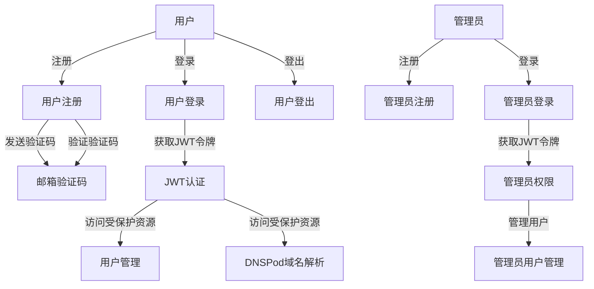
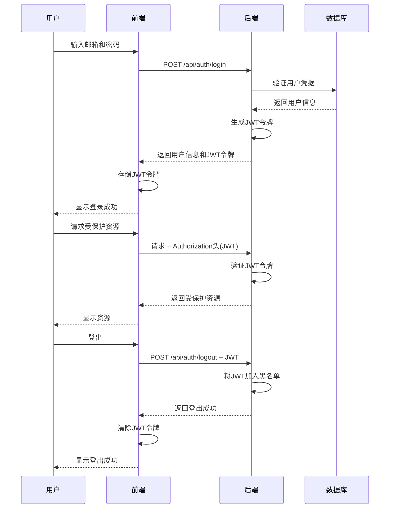
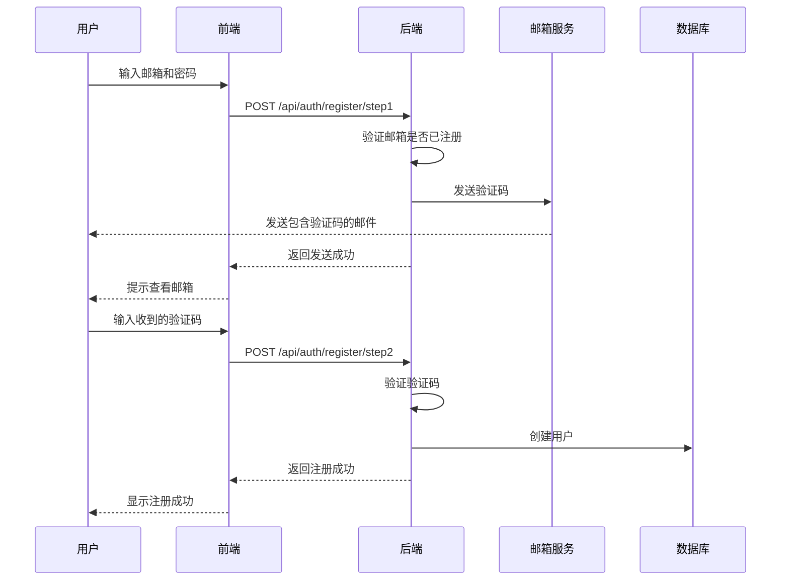
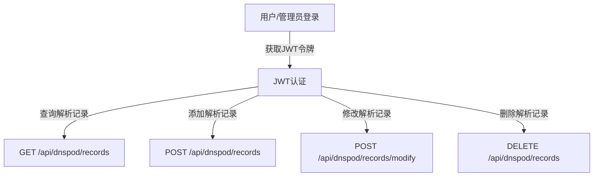

# API接口关系图

## 一、接口关系总览



## 二、用户认证流程



## 三、用户注册流程



## 四、管理员用户管理流程

```mermaid
graph TD
    A[管理员登录] -->|获取JWT令牌| B[管理员权限]
    B -->|查询用户| C[GET /api/admin/users/]
    B -->|查询单个用户| D[GET /api/admin/users/{id}]
    B -->|创建用户| E[POST /api/admin/users]
    B -->|更新用户| F[PUT /api/admin/users/{id}]
    B -->|删除用户| G[DELETE /api/admin/users/{id}]
    B -->|邮箱查询用户| H[GET /api/admin/users/email/{email}]
```

## 五、DNSPod域名解析流程



## 六、接口依赖关系

### 1. 用户认证依赖
- 用户登录 → JWT令牌 → 访问受保护资源
- 用户注册 → 邮箱验证码 → 用户创建

### 2. 管理员功能依赖
- 管理员登录 → JWT令牌 → 管理员权限 → 用户管理操作

### 3. DNSPod功能依赖
- 用户/管理员登录 → JWT令牌 → DNSPod操作权限 → DNS记录管理

## 七、接口调用顺序建议

### 用户注册与登录
1. POST /api/auth/register/step1 (发送验证码)
2. POST /api/auth/register/step2 (验证并完成注册)
3. POST /api/auth/login (登录获取JWT令牌)

### 用户管理
1. GET /api/users (获取用户列表)
2. GET /api/users/{id} (获取单个用户)
3. PUT /api/users/{id} (更新用户信息)

### 管理员操作
1. POST /api/admin/login (管理员登录)
2. GET /api/admin/users/ (获取所有用户)
3. POST /api/admin/users (创建用户)
4. PUT /api/admin/users/{id} (更新用户)
5. DELETE /api/admin/users/{id} (删除用户)

### DNSPod域名解析
1. GET /api/dnspod/records (查询解析记录)
2. POST /api/dnspod/records (添加解析记录)
3. POST /api/dnspod/records/modify (修改解析记录)
4. DELETE /api/dnspod/records (删除解析记录)